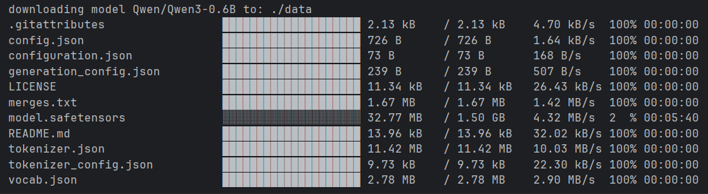

用于从Modelscope下载模型的CLI工具。

安装：
你可以通过以下方式之一安装：

- 使用Cargo安装

```shell
cargo install modelscope
```

- 下载预编译的包
  从发布页面下载对应操作系统的二进制包，并解压。

使用方式：

```shell
modelscope -m <MODEL_ID> -s <SAVE_DIR>
```



命令：

```shell
Usage: modelscope [OPTIONS] --model-id <MODEL_ID>

Options:
  -m, --model-id <MODEL_ID>  model id
  -s, --save-dir <SAVE_DIR>  save dir, if not set, use current dir, will create if not exists [default: ]
  -h, --help                 Print help
  -V, --version              Print version
```